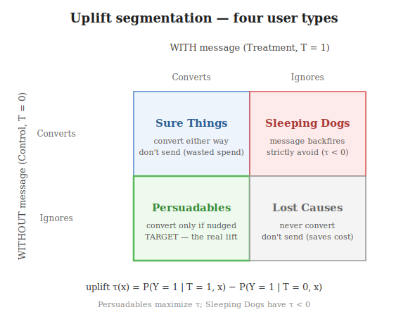

# Estimands: What Exactly Are We Trying to Measure?

Before picking a method, name the **number** you want. *"Does the notification work?"* has at least
three precise answers that can disagree. An **estimand** is that target — defined *before* you touch
data or algorithms. Get it wrong and a perfectly fit model answers a question nobody asked.

---

## Two frameworks for defining an effect

First you need a *language* for "an effect." Two are standard — both **theory, not estimators** (the
estimators that operationalize them live in the [methods taxonomy](03_methods_taxonomy.md)):

- **Potential Outcomes** — causation as a *missing-data problem*.
  - Each unit has two hypothetical outcomes: $Y_i(1)$ (if treated), $Y_i(0)$ (if not).
  - Individual effect $= Y_i(1) - Y_i(0)$, but you only observe one → the other is missing.
  - $Y(1), Y(0)$ are **counterfactual** (what *could* happen) — distinct from filtering the database
    to rows where $T=1$ (what you *observed*).
  - Becomes a clean contrast only under **ignorability** (last section).
- **Structural Causal Models (SCMs) & DAGs** — causation as a *graph*.
  - Draw the assumed cause→effect arrows; interventions use the **do-operator** $do(X=x)$ — *forcing*
    a value, not observing it.
  - The graph tells you which variables to adjust for (backdoor) and which to avoid (colliders).

> **Key idea:** Potential Outcomes is the *accounting* of effects; DAGs are the *map* of where they
> flow. Most work uses the graph to justify the adjustment set and the potential-outcome algebra to
> define the target.

---

## The three estimands: ATE, CATE, ATT

**Average Treatment Effect (ATE)** — *"if we treated everyone vs no one, what is the average change?"*

$$\text{ATE} = E\big[\,Y(1) - Y(0)\,\big]$$

The single global number — use it for a rollout go/no-go. Weakness: an ATE near zero can hide a
treatment that **helps half the users and hurts the other half** (the effects cancel).

**Conditional ATE (CATE)** — *"for **this kind** of user, what is the average change?"*

$$\tau(x) = E\big[\,Y(1) - Y(0) \mid X = x\,\big]$$

The ATE conditioned on features $X = x$ — the engine of personalization. Lets the effect vary: an
overall $+2\%$ can be $+13\%$ for one segment and $-5\%$ for another. Everything in
[meta-learners](05_meta_learners.md) and [DML](06_double_machine_learning.md) estimates $\tau(x)$.

**ATE on the Treated (ATT)** — *"for the users who **actually got** treated, what was the average
change?"*

$$\text{ATT} = E\big[\,Y(1) - Y(0) \mid T = 1\,\big]$$

Restricts the average to the treated subpopulation — matters when treatment is **not** random. E.g. an
offer shown only to users who open the app: ATE imagines forcing it on *everyone* (diluting with users
who never log in); ATT isolates the effect on those the policy actually reached.

| Estimand | Conditioning | Question | Typical use |
|----------|-------------|----------|-------------|
| **ATE** | none | effect on the *whole* population | rollout go/no-go |
| **CATE** | on $X = x$ | effect for a *segment* | personalization, targeting |
| **ATT** | on $T = 1$ | effect on those *actually treated* | evaluating a deployed, non-random policy |

> **Key idea:** ATE is one number for everyone, CATE is a *function* of features, ATT is the number
> for whoever the treatment reached. Name which one you want **first**.

---

## CATE in practice: uplift

When the treatment is a marketing action and the outcome is conversion, CATE has a name: **uplift** —
the *incremental* conversion caused by the action.

$$\tau(x) = P(Y = 1 \mid T = 1, x) - P(Y = 1 \mid T = 0, x)$$

Sorting users by $\tau(x)$ gives four behavioural types:

| Segment | With message | Without message | $\tau$ | Action |
|---------|-------------|-----------------|--------|--------|
| **Persuadables** | converts | ignores | large $> 0$ | **target** — the real lift |
| **Sure Things** | converts | converts | $\approx 0$ | don't send — convert anyway |
| **Lost Causes** | ignores | ignores | $\approx 0$ | don't send — nothing reaches them |
| **Sleeping Dogs** | ignores | converts | $< 0$ | strictly avoid — message **backfires** |

Plain-English $\tau$ = **"treatment successes minus control successes."** Message 50 users (15
convert) and withhold from 50 comparable users (10 convert anyway) → the campaign caused $15 - 10 = 5$,
not 15. Those 5 are the Persuadables; uplift modelling finds *who they are*.

> **Key idea:** uplift is just CATE for a 0/1 outcome. A "who will convert?" model finds the 15; an
> uplift model finds the 5 the action is *responsible* for.

---

## The bridge: observed data vs potential outcomes

Estimands use counterfactuals ($Y(1), Y(0)$); a model only sees observed $Y, T, X$. When are they
equal — i.e. when does

$$E[\,Y(1) \mid X\,] \;\overset{?}{=}\; E[\,Y \mid X, T = 1\,]$$

hold? Only under **ignorability** / **unconfoundedness**:

$$\big(Y(1), Y(0)\big) \perp\!\!\!\perp T \;\mid\; X$$

In words: once you condition on $X$, *who gets treated is independent of how they would respond* — no
hidden variable steers both. This is the "no unclosed backdoor path" condition from
[foundations](01_foundations.md), written formally. When it holds (an RCT, or $X$ captures all
confounders), CATE becomes fully observable:

$$\tau(x) = E[\,Y \mid X = x, T = 1\,] - E[\,Y \mid X = x, T = 0\,]$$

> **Key idea:** $Y(1), Y(0)$ are the *meaning*; $E[Y\mid X, T]$ is what the data *gives you*.
> Ignorability lets you swap one for the other. If it fails, every downstream method is biased —
> which is why the [method taxonomy](03_methods_taxonomy.md) exists.
