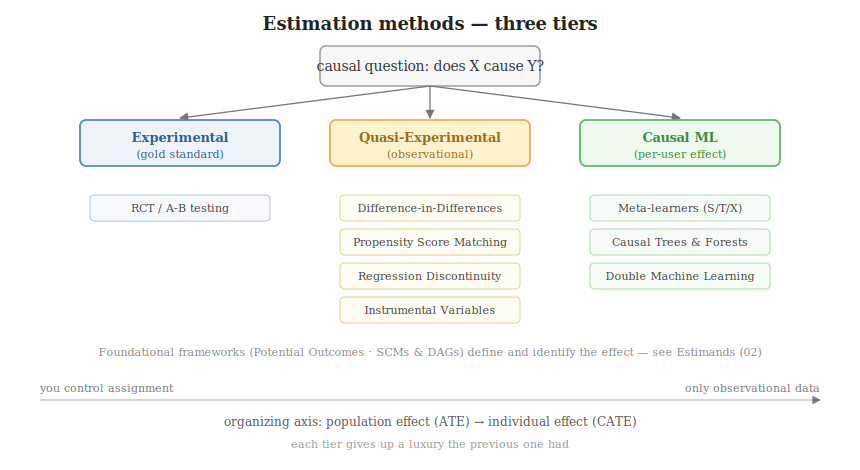

# The Methods Taxonomy

After naming the estimand, pick a method to recover it — and *which* method is legal depends on **how
much control you had over who got treated.** Estimation methods sort into three tiers, from the
experiment that *creates* a causal contrast to the ML that *personalizes* it. (The two frameworks that
*define and identify* effects — Potential Outcomes and SCMs/DAGs — are theory, not estimators, and
live in [estimands](02_estimands.md).)

Each method below is `<type>: <method>` with its core idea, key assumption, and a *use-when*.

## Why this hierarchy

Ordered by **how much luxury you have**; each tier gives up something the previous one had:

1. **Experimental** — you *own the assignment mechanism* (the ideal; everything else imitates it).
2. **Quasi-experimental** — you've *lost control of assignment*; recover it from the structure of
   observational data.
3. **Causal ML** — you also have *high-dimensional features* and want a *per-user* answer, not one
   average.

The same axis runs **population (ATE) → individual (CATE)**: early tiers estimate one global number
under tight control; the last estimates a personalized function from abundant but uncontrolled data —
which is why the causal-ML methods get their own deep-dive files
([05](05_meta_learners.md), [06](06_double_machine_learning.md)).

---

## Experimental: Randomized Controlled Trial (RCT)

- **Idea.** Randomly assign treatment vs control (the A/B test). Randomization makes the groups
  identical *in expectation*, severing every backdoor path at once — a plain difference of means is
  already causal, no modelling required.
- **Assumption.** Assignment is genuinely random, with a real holdout.
- **Use when.** You can ethically and practically withhold treatment from a random group. The **gold
  standard** — every method below exists because this one is often impossible.

> **Key idea:** in an RCT, ignorability holds *by construction* — you don't assume away confounding,
> you engineer it out.

---

## Quasi-experimental methods (observational data)

Can't randomize → exploit a quirk of the data that *mimics* randomization.

### Quasi-Experimental: Difference-in-Differences (DiD)

- **Idea.** Compare the *change over time* in a treated group to the change in an untreated group.
  Subtracting the two changes cancels any fixed baseline gap *and* any common time trend.
- **Assumption.** **Parallel trends** — absent treatment, both groups would have moved in parallel.
- **Use when.** Before/after data spanning a discrete intervention (a policy change, a staggered
  regional launch).

### Quasi-Experimental: Propensity Score Matching (PSM)

- **Idea.** Estimate each unit's probability of *being treated*, $e(x) = P(T=1\mid X=x)$; pair treated
  and untreated units with near-identical scores — "statistical twins" that recreate mini-experiments.
- **Assumption.** No unobserved confounding — $X$ holds everything driving both treatment and outcome.
- **Use when.** Treatment was assigned non-randomly but on *observed* characteristics you recorded.

### Quasi-Experimental: Regression Discontinuity Design (RDD)

- **Idea.** Exploit a sharp cutoff (a scholarship at score $\geq 80$). Units just below vs just above
  are near-identical, so the cutoff acts as local randomization.
- **Assumption.** Units can't precisely manipulate their side of the cutoff; nothing else jumps at the
  threshold.
- **Use when.** Treatment is decided by a strict numeric rule.

### Quasi-Experimental: Instrumental Variables (IV)

- **Idea.** Find an *instrument* $Z$ that nudges treatment but affects the outcome *only through*
  treatment. The $Z$-driven part of treatment is as-good-as-random.
- **Assumption.** $Z$ is relevant (moves $T$), exclusion (affects $Y$ only via $T$), independent of
  confounders.
- **Use when.** There is unobserved confounding *and* a credible instrument exists (the hard part).

---

## Causal machine learning

Scale to *individual* effects (CATE) with flexible ML base learners.

### Causal ML: Meta-Learners

- **Idea.** Recipes that wrap standard ML to output $\tau(x)$: **S** ($T$ as a feature), **T**
  (separate treated/control models, subtract), **X** (cross-impute counterfactuals, re-fit). Full
  detail in [05_meta_learners.md](05_meta_learners.md).
- **Assumption.** Ignorability given $X$ — they *personalize* an already-identified effect; they don't
  fix confounding.
- **Use when.** You ran an experiment (or trust ignorability) and want *who responds most*.

### Causal ML: Causal Forests

- **Idea.** Random forests re-purposed: splits chosen to **maximize the difference in treatment
  effect** between child nodes (hunting heterogeneity), with honest confidence intervals on $\tau(x)$.
- **Assumption.** Ignorability given $X$.
- **Use when.** You want CATE estimates *with* uncertainty, or to discover which features drive effect
  heterogeneity.

### Causal ML: Double Machine Learning (DML)

- **Idea.** Use ML to *predict away* confounders from both outcome and treatment, then regress the
  leftover **residuals** — isolating the effect from baseline noise. Full detail in
  [06_double_machine_learning.md](06_double_machine_learning.md).
- **Assumption.** Ignorability given $X$; nuisance models reasonably accurate (via cross-fitting).
- **Use when.** Observational data with *many* confounders and a strong baseline that would otherwise
  drown the effect.

---

## Which method when

| Situation | Reach for |
|-----------|-----------|
| You can randomize | **RCT** (+ meta-learners / causal forests for CATE) |
| Non-random assignment on *observed* features | **PSM** or **DML** |
| Unobserved confounding, valid instrument exists | **IV** |
| Before/after an intervention, with a comparison group | **DiD** |
| Treatment set by a numeric cutoff | **RDD** |
| Per-user effect for targeting | **Meta-learners** (X-learner if imbalanced) |
| Per-user effect **+ uncertainty** | **Causal Forests** |
| Many confounders, strong baseline, observational | **DML** |

> **Key idea:** the method is dictated by *how treatment was assigned*, not preference. The first
> question is always *"how did units come to be treated?"* — the answer rules most methods in or out
> before any code is written.
