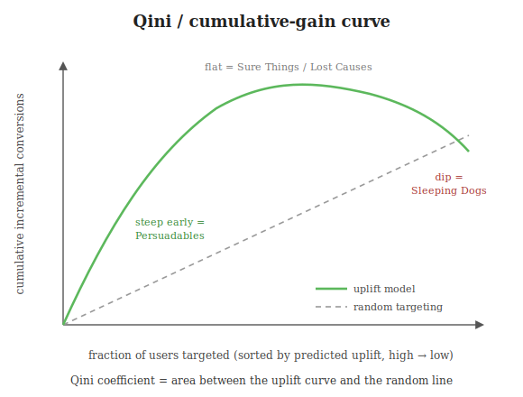

# Evaluating Causal & Uplift Models

The trap that makes causal evaluation different: **you can never check a single prediction against the
truth.** Ordinary ML predicts "user converts," waits, and checks. Causal ML predicts an *uplift* — a
difference between two outcomes for the *same* user — and you only ever observe **one** of them. The
label you'd need to grade an individual does not exist. So evaluation moves from the *individual* to
the *cohort* level, and the familiar metrics break.

---

## The evaluation cohort

Everything below scores the **same set of users**, so define it up front:

- A **fresh randomized holdout** the model **never trained on**.
- Contains **both treated and control** users (you need both to compute lift).
- Assignment within it is **randomized**, so treated vs control are comparable.
- Scored **once** — the same cohort feeds the curve, the decile table, and both success layers.

> **Key idea:** with no per-user label, this holdout *is* your ground truth — its treated-vs-control
> gaps are the only honest measure of lift.

---

## Why standard ML metrics fail

| Metric | What it scores | Why it breaks |
|--------|----------------|---------------|
| **ROC-AUC** (Receiver Operating Characteristic – Area Under Curve) | ranking of *who converts* | a model can perfectly rank converters yet be useless at ranking *who was persuaded* — different orderings |
| **Accuracy / R²** | error vs the observed label $Y$ | the target is $Y(1) - Y(0)$, and one term is *always missing* — no per-row label to score against |
| **Log-loss** | calibration of $P(Y\mid X)$ | calibrating the *outcome* says nothing about the *difference between two outcomes* |

Deeper reason: all of these grade a model on predicting $Y$; uplift is a counterfactual *contrast*
that is never recorded. A model that nails conversion (high AUC) may just be re-finding the Sure
Things.

> **Key idea:** a great *propensity* model (who converts) is not a great *uplift* model (who converts
> *because* of the treatment).

---

## The building block: treatment minus control

For any chosen set of users:

$$\text{incremental lift} = \big(\text{conv. rate} \mid T=1\big) - \big(\text{conv. rate} \mid T=0\big)$$

Within the randomized holdout the treated and control subsets are comparable, so this difference *is*
the causal lift. Every metric below is built from this one subtraction.

---

## Cumulative-gain and Qini curves

The premise: *sort users high → low predicted uplift — does the real lift show up where the model
said it would?*

Build it:

1. Score every holdout user's predicted uplift.
2. Sort high → low.
3. Walking down (top 10%, 20%, …), plot **cumulative incremental lift** vs **fraction targeted**.

Read the shape:

- **Steep early rise** — the top-scored users really are Persuadables. The win.
- **Flat middle** — next users add ~zero lift → the model parked Sure Things / Lost Causes here.
- **Dip at the end** — lowest-scored users *lose* conversions when treated → Sleeping Dogs.
- **Diagonal baseline** — random targeting. The gap, summarized as the **Qini coefficient** (area
  between the curve and the diagonal), is the headline score.

> **Key idea:** the curve answers the operational question — *"if I message only the top X%, how much
> of the achievable lift do I capture?"* Steep and early-peaking = a small, cheap target set captures
> most of the value.

---

## The decile sanity-check table

Bin holdout users into deciles by predicted uplift; print the *raw* treated vs control conversion per
bin. A working model is monotone:

| Predicted-uplift tier | Treated | Control | Net lift | Verdict |
|-----------------------|---------|---------|----------|---------|
| Top 20% | 18% | 5% | **+13%** | Persuadable — target |
| Middle 40% | 12% | 12% | 0% | Sure Things / Lost Causes — suppress |
| Bottom 20% | 4% | 9% | **−5%** | Sleeping Dogs — strictly suppress |

A large gap in the high tier *and* control beating treatment in the bottom tier → the scores sort
correctly. Flat or non-monotone → the scores are noise, no matter how good the curve looked.

---

## Two layers of success

A model is a success only when **both** hold:

**1. Statistical success — the model ranks users correctly.**
- Qini coefficient meaningfully above random (e.g. **0.18 vs 0.04**).
- Monotone decile table (top **+13%**, bottom **−5%**).

**2. Deployment success — acting on the scores improves the real world, together:**
- **Volume / cost** — same loan applications with **~40% fewer WhatsApps** (dropping Sure Things and
  Lost Causes).
- **Churn** — opt-out / uninstall rate falls (e.g. **3% → 1%**) by no longer poking Sleeping Dogs.
- **ROI** — cost per *incremental* conversion drops (e.g. **₹120 → ₹70**); spend stops flowing to
  users who would have converted anyway.

> **Key idea:** statistical success is checked on the holdout *before* launch; deployment success is
> measured *after* acting on the scores — the same lift for less spend and less churn. They move
> together, so treat them as one bar.
