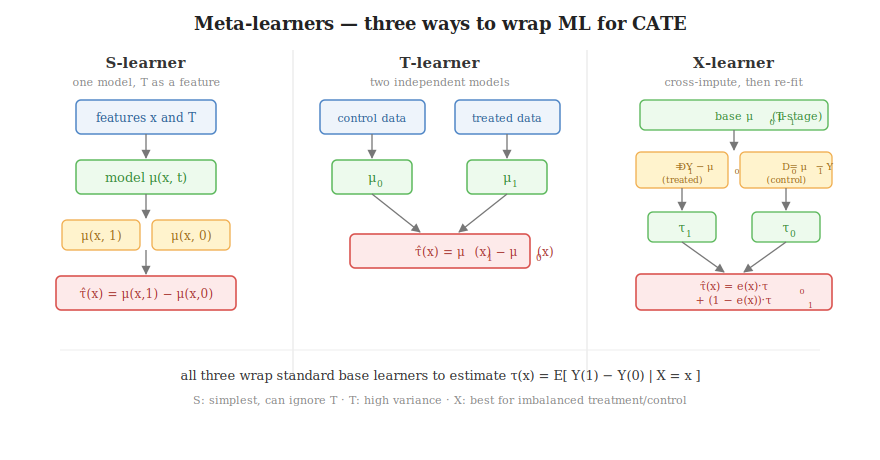

# Causal ML: Meta-Learners

A standard ML model predicts a *single* outcome — *will this user convert?* It has no native notion of
a treatment effect, because an effect is a **difference between two parallel worlds** and the model
sees only one. A **meta-learner** is a recipe that orchestrates ordinary models (XGBoost, LightGBM,
logistic regression) to estimate the **Conditional Average Treatment Effect (CATE)**
$\tau(x) = E[Y(1) - Y(0)\mid X=x]$ anyway. "Meta" = *a learner about learners*: no new gradient or
split rule, just standard learners arranged in stages.

Assumes ignorability (an RCT or a credible adjustment set) — meta-learners *personalize* an
already-identified effect; they don't fix confounding (that's [DML](06_double_machine_learning.md)).

---

## S-Learner (single model)

One model on all the data, with treatment $T$ as just another feature:

$$\mu(x, t) = E[\,Y \mid X = x, T = t\,] \qquad \hat{\tau}(x) = \mu(x, 1) - \mu(x, 0)$$

- **Pro.** Simplest; one model; stable.
- **Con.** With hundreds of features and one $T$ column, a regularized learner may **split $T$ away**
  → $\hat{\tau}(x) \to 0$ for everyone. The treatment signal drowns.

---

## T-Learner (two models)

Separate the data; train two independent models:

$$\mu_1(x) = E[Y\mid x, T=1], \quad \mu_0(x) = E[Y\mid x, T=0] \qquad \hat{\tau}(x) = \mu_1(x) - \mu_0(x)$$

- **Pro.** $T$ can never be regularized away — it picks the model.
- **Con.** The models never talk; each minimizes *its own* error, so independent errors **add** on
  subtraction → high variance. Worse under imbalance: a tiny control set makes $\mu_0$ noisy, polluting
  every prediction.

---

## X-Learner (crossed learner)

- **Goal.** Estimate $\tau(x) = E[Y(1) - Y(0)\mid x]$. If we saw *both* worlds per user it'd be a label
  to regress on $X$ — but each user shows only one.
- **① Impute → $\tilde{D}$.** Since $\tau = Y(1) - Y(0)$, keep the *observed* potential outcome and
  impute the *missing* one with the **other** group's T-stage model — $\mu_0(x)$ guesses $Y(0)$,
  $\mu_1(x)$ guesses $Y(1)$. Each user gets a per-user effect $\tilde{D}$ = real − imputed (noisy uplift only):
  - treated (observed $Y = Y(1)$): $\;\tilde{D}_1 = Y(1) - \mu_0(x)$
  - control (observed $Y = Y(0)$): $\;\tilde{D}_0 = \mu_1(x) - Y(0)$
- **② Regress → $\tau_0(x),\,\tau_1(x)$.** Fit $\tau_1(x) \approx \tilde{D}_1$ on treated users and
  $\tau_0(x) \approx \tilde{D}_0$ on control users — the *same* features $x$, but the **target flips from
  $Y$ to $\tilde{D}$**, and that flip is the whole point:
  - *Attention.* The baseline models chased $Y$, so they spent their capacity on features that move the
    large baseline and could ignore one that only moves the small effect. Retargeting on $\tilde{D}$
    forces a fresh model to hunt exactly the effect-driving features (a T-learner's $\mu_1 - \mu_0$ can't).
  - *Generalize + denoise.* A raw $\tilde{D}$ exists only for training users and is a noisy point estimate;
    the regression turns it into a smooth function that scores unseen users and averages out per-user noise.
  - *Common domain.* $\tilde{D}_1$ and $\tilde{D}_0$ live on different people — only as functions of $x$
    can ③ blend them at the same point.
- **What breaks** — each route leans on the *opposite* group's model, so they fail in opposite regimes:
  - $\tilde{D}_1$ uses $\mu_0$ (control): small control → noisy labels, but $\tau_1$ trains on the broad treated set.
  - $\tilde{D}_0$ uses $\mu_1$ (treated): huge treated → clean labels, but $\tau_0$ trains on few controls (narrow).
- **③ Combine → $\hat{\tau}(x)$.** Weight the regression outputs $\tau_0(x),\,\tau_1(x)$ (**not** the raw
  $\tilde{D}$'s) by propensity $e(x) = P(T=1\mid x)$, leaning on the better-fed side:
$$\hat{\tau}(x) = e(x)\,\tau_0(x) + \big(1 - e(x)\big)\,\tau_1(x)$$
  - **99% treated:** $e \approx 0.99$ → trusts $\tau_0$ (labels from the accurate $\mu_1$); starved $\mu_0$ barely counts.
  - **50/50:** $e = 0.5$ → equal weight.
- **Keep both** — the two trade-offs above are complementary, so blending them is an ensemble; and at
  50/50 propensity weights them equally, so dropping $\tilde{D}_1$ would waste half a balanced experiment.

> **Key idea:** ① impute a per-user effect $\tilde{D}$ from each group, ② regress it on $x$ into two
> functions $\tau_0(x),\,\tau_1(x)$, ③ propensity-weight them so the better-fed base model dominates.

---

## Choosing among S / T / X

| Learner | Structure | Best when | Main weakness |
|---------|-----------|-----------|---------------|
| **S** | one model, $T$ as feature | few features, want simplicity | can regularize $T$ away → zero uplift |
| **T** | two independent models | balanced groups (≈ 50/50) | high variance; fragile under imbalance |
| **X** | T-stage + cross-imputed re-fit | **imbalanced** groups (small control) | most moving parts; needs a propensity model |

> **Key idea:** start with a **T-learner** when groups are balanced and you want something intuitive;
> upgrade to an **X-learner** when the control group is small or T/S scores look noisy. **EconML**
> (Microsoft) and **CausalML** (Uber) ship all three.
