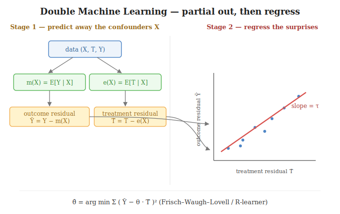

# Double Machine Learning (DML)

When the path from $X$ to $Y$ is **nonlinear and high-dimensional**, the propensity-score and
meta-learner toolkits both lean on a model that may quietly carry residual confounding through. DML
attacks this differently: use any flexible ML model to **predict away** the influence of $X$ on
both the outcome *and* the treatment, then estimate $\theta$ from the **leftover variation only**.
The framing is Robinson's (1988) partial-out trick, made rigorous for ML nuisance estimators by
Chernozhukov et al. (2018).

Assumes [ignorability](02_estimands.md) given $X$ — like every covariate-adjustment method. What it
doesn't assume is that $X \to Y$ or $X \to T$ is linear; that flexibility is exactly why it works
where OLS partialling-out and logistic-regression [PSM](07_propensity_methods.md) would not.

---

## The setup: partially linear model

$$Y = \theta_0\,T + g_0(X) + \varepsilon, \qquad T = m_0(X) + \eta$$

with $E[\varepsilon \mid X, T] = 0$ and $E[\eta \mid X] = 0$.

- $\theta_0$ — the **causal parameter** of interest (a scalar effect of $T$ on $Y$).
- $g_0(X) = E[Y(0) \mid X]$ — how $X$ moves the **baseline outcome**.
- $m_0(X) = E[T \mid X] = e(X)$ — how $X$ moves the **propensity to be treated**.

$g_0$ and $m_0$ are *nuisance* functions: needed to estimate, but not the answer. Their job is to
soak up the parts of $Y$ and $T$ that $X$ already explains, so the leftover slice of $T$ can claim
the leftover slice of $Y$.

---

## The algorithm

Three models, each touching the data through a different door — and each fit on data **disjoint
from the data where it is used**.

- **① Outcome model $\hat\ell(X)$.** Any ML regressor with target $Y$ and features $X$ *only* (no $T$),
  trained to predict $E[Y \mid X]$. Gradient boosting, random forest, ridge, MLP — anything expressive
  enough for the baseline.
  - We regress on $Y$ **as-is**, including the part driven by $T$. We are *not* trying to recover
    $g_0(X)$ in isolation; we are recovering $\ell_0(X) := E[Y \mid X]$. The next section explains
    why this is the right object.

- **② Treatment model $\hat m(X)$.** A regressor (classifier when $T \in \{0,1\}$) with target $T$
  and features $X$, trained to predict $E[T \mid X]$.
  - This is the same *estimand* as the propensity score $e(x)$, but DML uses it as a
    **residualizer** — to strip $X$'s pull out of $T$ — not as a matching key or a weight.

- **③ Cross-fitting — the data plumbing.** Both nuisance models are fit by **K-fold cross-fitting**
  ($K = 5$ or $10$):
  - split the data into $K$ folds;
  - for each fold $k$, train $\hat\ell$ and $\hat m$ on the *other* $K - 1$ folds and predict on
    fold $k$ (out-of-fold);
  - stack so every row has $\hat\ell(x_i)$ and $\hat m(x_i)$ from a model that **never trained on
    $i$**.
  - No nuisance prediction is ever evaluated on a row it saw at training time — this is what keeps
    the orthogonality argument honest (see *Why error stays controlled*).

- **④ Residualize.** Build the leftover variation $X$ couldn't predict:

  $$\tilde Y_i = Y_i - \hat\ell(X_i), \qquad \tilde T_i = T_i - \hat m(X_i)$$

  - $\tilde Y$ = the part of the outcome $X$ couldn't explain.
  - $\tilde T$ = the part of the treatment $X$ couldn't explain.
  - These are the **only** variation $\theta_0$ can claim credit for.

- **⑤ Final stage — regress $\tilde Y$ on $\tilde T$.** A one-variable OLS:

  $$\hat\theta = \frac{\sum_i \tilde T_i \tilde Y_i}{\sum_i \tilde T_i^{\,2}}$$

  - Equivalently, the root of the **DML score**:

  $$\psi(W;\,\theta, \ell, m) = \big(Y - \ell(X) - \theta\,(T - m(X))\big)\big(T - m(X)\big), \qquad \frac{1}{N}\sum_i \psi(W_i;\,\hat\theta,\, \hat\ell, \hat m) = 0$$

  - For the partially linear model this is exactly residual-on-residual OLS. For binary-treatment
    ATE, IV-DML, R-learner CATE, etc., the *score* changes shape — but the framework (cross-fitted
    nuisance + orthogonal score) is identical.

> **Key idea:** two ML models eat the confounding ($\hat\ell$ from the outcome side, $\hat m$ from
> the treatment side, both cross-fitted), and a one-variable OLS on the residuals reads off $\theta$.

---

## Why it works: Robinson's trick

The natural objection: *if I regress $Y$ on $X$ to get $\hat\ell$, but $Y$ already contains
$\theta\,T$, won't $\hat\ell$ swallow part of the treatment effect and bias $\hat\theta$ toward zero?*
The algebra says no — and it starts from the model for $Y$ itself.

- **Start from the outcome model.** The partially linear model says

  $$Y = \theta_0\,T + g_0(X) + \varepsilon$$

- **Take the conditional expectation given $X$.** Average both sides over $X$; since
  $E[g_0(X) \mid X] = g_0(X)$ and $E[\varepsilon \mid X] = 0$:

  $$E[Y \mid X] = \theta_0\,E[T \mid X] + g_0(X) = \theta_0\,m_0(X) + g_0(X)$$

  - So what step ① actually estimates is $\ell_0(X) = \theta_0\,m_0(X) + g_0(X)$ — the slice of $Y$
    that **$X$ alone** can predict, *including* the treatment-mediated piece $\theta_0\,m_0$.

- **Take the difference** $Y - \ell_0(X)$ — subtract the second equation from the first, line by line:

  $$Y - \ell_0(X) \;=\; \underbrace{\theta_0\,T + g_0(X) + \varepsilon}_{Y} \;-\; \underbrace{\theta_0\,m_0(X) - g_0(X)}_{\ell_0(X)} \;=\; \theta_0\,\big(T - m_0(X)\big) + \varepsilon$$

  - The $g_0(X)$ **cancels** — the nuisance baseline is gone without ever isolating it.
  - The $\theta_0\,m_0(X)$ left behind is exactly $\theta_0$ times the **treatment residual**
    $T - m_0(X)$ from step ②.

- **Read off the result.** The treatment signal was not lost — it was **transferred from $Y$ onto
  the residual $\tilde T = T - m(X)$**, where the step-⑤ regression recovers it cleanly as
  $\hat\theta$.

- **The punchline on $\hat g$.** We never estimate $g_0$ in isolation, and we never need to. We
  estimate $\ell_0 = E[Y \mid X]$ — regressing over $Y$ *as a whole* — and that single object
  absorbs both the unwanted baseline $g_0$ **and** the $\theta_0 m_0$ piece along the confounded
  path, leaving a clean linear equation in $\theta_0$.

> **Key idea:** the outcome model targets $E[Y \mid X]$, not $g(X)$. The $\theta\,m(X)$ component
> bundled inside $\ell$ is a feature, not a bug — it's exactly what makes the residual equation
> reduce to $\theta_0\,\tilde T + \varepsilon$.

---

## Why the error stays controlled: Neyman orthogonality

DML stacks two imperfect ML models into a downstream regression — naively, their errors should
compound and blow up $\hat\theta$. They don't, and the property that saves us has a name:
**Neyman orthogonality**.

- **What orthogonality buys.** The DML score $\psi$ is built so that nuisance mistakes don't enter
  $\hat\theta$ **linearly** — they enter only as a **product** $(\hat\ell - \ell_0)\cdot(\hat m - m_0)$.

- **Why the errors get controlled (the logical reason).** At the true $\theta_0$, the score is
  *flat* in the direction of the nuisance functions: nudge $\hat\ell$ or $\hat m$ slightly and the
  estimating equation for $\theta$ barely moves. A small nuisance error pushes you *sideways along
  a flat ridge*, not down a slope — so it never tilts $\hat\theta$ to first order. The only error
  that survives is the *second-order* leftover, the product of two small mistakes.

- **Why a product is so much smaller.** If each ML model is off by $\sim 10\%$, a method that
  propagated error linearly would leave $\hat\theta$ off by $\sim 10\%$. The product is
  $10\% \times 10\% = 1\%$ — an order of magnitude smaller. That's enough for $\hat\theta$ to keep
  valid standard errors and confidence intervals even when both nuisance models are individually
  mediocre. Two slow ML models compose into one fast, trustworthy causal estimate.

- **Cross-fitting is the operational half.** The product bound only holds if $\hat\ell$ and
  $\hat m$ are independent of the rows they score. Train and predict on the same data and
  overfitting sneaks in a correlation that breaks the bound; out-of-fold prediction (step ③)
  restores the independence the argument needs.

> **Key idea:** orthogonality flattens the score so nuisance error hits $\hat\theta$ as a *product*,
> not a sum; cross-fitting keeps that product honest. Together they let "good but not great" ML
> drive valid causal inference — that's what makes DML noble rather than a pile of stacked
> regressions.
