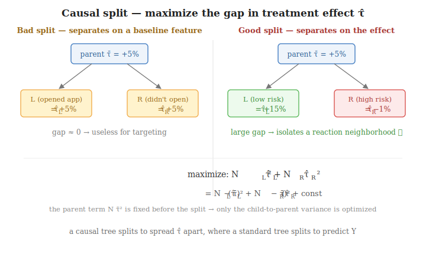
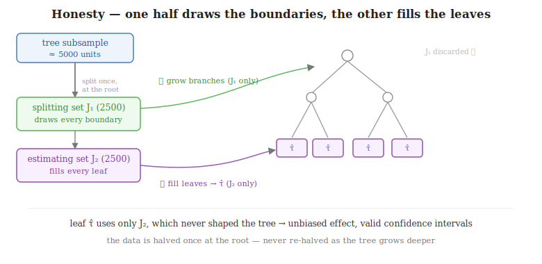
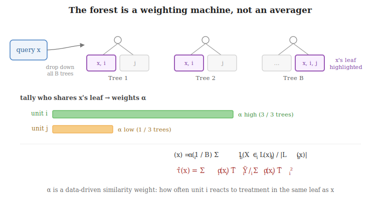

# Causal Forests

A standard random forest averages leaf outcomes to estimate $E[Y \mid X]$ — a quantity you can
*observe* and train against. The treatment effect $\tau(x) = E[Y(1) - Y(0) \mid X = x]$ is not: each
unit reveals only one of its two potential outcomes, so the regression target **never exists in the
data**. A causal forest gets around this by re-purposing the forest in two ways at once:

- **Splits hunt heterogeneity, not outcome variance** — a node divides where the treatment effect
  $\tau$ differs most between the two sides, instead of where $Y$ is easiest to predict.
- **The forest is a weighting machine, not an averager** — it outputs an *adaptive similarity kernel*
  $\alpha_i(x)$, and $\hat\tau(x)$ is read off a **locally weighted regression**, not a leaf mean.

---

## The setup: orthogonalize first

Everything downstream runs on **residuals**, not raw $Y$ and $T$. Assume the partially linear model

$$Y = \tau(X)\,T + g(X) + \varepsilon, \qquad E[\varepsilon \mid X, T] = 0,$$

where $g(X)$ is the baseline outcome and $\tau(X)$ is the local effect we want. Define the two
nuisances $\ell(X) = E[Y \mid X]$ and $m(X) = E[T \mid X]$, fit with any flexible ML model. Taking
$E[\cdot \mid X]$ of the model and subtracting it from the model itself makes the baseline cancel:

$$E[Y \mid X] = \tau(X)\,m(X) + g(X) \;\;\Longrightarrow\;\; \underbrace{Y - \ell(X)}_{\tilde Y} = \tau(X)\big(\underbrace{T - m(X)}_{\tilde T}\big) + \varepsilon.$$

So with the residuals $\tilde Y_i = Y_i - \hat\ell(X_i)$ and $\tilde T_i = T_i - \hat m(X_i)$, the
problem reduces to a clean local relationship:

$$\tilde Y_i \approx \tau(X_i)\,\tilde T_i + \varepsilon_i.$$

*Near a given $x$, the outcome surprise is the treatment surprise scaled by the local effect.* From
here on **"the data" means $(\tilde Y_i, \tilde T_i)$**, and every $\tau$ below is the slope relating
them.

> **Key idea:** orthogonalize once, up front. The forest then operates on residuals, so confounding
> from $X$ is already partialled out before a single split is evaluated.

---

## The algorithm

- **① Cross-fit the nuisances.** Split into folds; fit $\hat\ell(X)$ and $\hat m(X)$ out-of-fold and
  residualize to $(\tilde Y_i, \tilde T_i)$, so no row is residualized by a model that trained on it.

- **② Grow $B$ honest trees.** For each tree: subsample the data, then split that subsample into a
  **splitting half** and an **estimating half**.
  - Grow the tree on the splitting half by maximizing the heterogeneity objective
    $N_L\hat\tau_L^{\,2} + N_R\hat\tau_R^{\,2}$ — this fixes the tree's shape.
  - Drop the estimating half down the finished tree to populate the leaves.

- **③ At query $x$ — weight.** Drop $x$ down all $B$ trees and tally how often each training unit $i$
  lands in the same leaf as $x$: the adaptive weights $\alpha_i(x)$.

- **④ At query $x$ — estimate.** Solve the $\alpha_i(x)$-weighted residual regression for $\hat\tau(x)$.

> **Key idea:** trees are grown first with simple split math; the weights $\alpha_i(x)$ and the
> estimate $\hat\tau(x)$ are computed only later, per query. Steps ② – ④ each rest on a non-obvious
> choice — the next sections take them one at a time.

---

## The split objective: maximize heterogeneity

- A **standard** tree splits to minimize the prediction error of $Y$. A **causal** tree splits to
  maximize the gap in treatment effect between the two children:

$$\max_{\text{split}}\;\; N_L\,\hat\tau_L^{\,2} + N_R\,\hat\tau_R^{\,2},$$

  where $N_L, N_R$ are the child sizes and $\hat\tau_L, \hat\tau_R$ the effect inside each child.

- **This is between-child variance with the parent term dropped.** "Make the children differ" means
  maximize their spread around the parent effect $\bar\tau$, then simplify:
  - start from $N_L(\hat\tau_L - \bar\tau)^2 + N_R(\hat\tau_R - \bar\tau)^2$;
  - expand and substitute the parent identities $N_L + N_R = N$ and
    $N_L\hat\tau_L + N_R\hat\tau_R = N\bar\tau$:

$$N_L(\hat\tau_L - \bar\tau)^2 + N_R(\hat\tau_R - \bar\tau)^2 = N_L\hat\tau_L^{\,2} + N_R\hat\tau_R^{\,2} - N\bar\tau^{\,2};$$

  - $N$ and $\bar\tau$ are fixed before the split, so $N\bar\tau^{\,2}$ is constant and drops — leaving
    exactly the objective above.

- **Why heterogeneity is the right compass.**
  - A split on a *baseline* feature gives two children with the same $\hat\tau$ → variance $\approx 0$
    → useless for targeting.
  - A split that separates strong responders from weak ones scores high → leaves end up **pure in
    effect**, which is what the prediction stage exploits.

---

## Computing the node effects $\hat\tau_L$ and $\hat\tau_R$

The objective needs an effect for each candidate child. It is the **node-local** effect — a
one-variable regression of $\tilde Y$ on $\tilde T$ over **only the units in that child** (the residual
slope from the setup):

$$\hat\tau_L = \frac{\sum_{i \in L} \tilde T_i\,\tilde Y_i}{\sum_{i \in L} \tilde T_i^{\,2}}, \qquad \hat\tau_R = \frac{\sum_{i \in R} \tilde T_i\,\tilde Y_i}{\sum_{i \in R} \tilde T_i^{\,2}}.$$

Every unit in the child counts equally, and the sum runs over $i \in L$ (or $R$) — the units in that
one child, not the whole dataset. Here $\hat\tau$ is a plain **node-level average effect**, computed
purely to score the split.

---

## Choosing splits and growing the tree

How a node actually picks its split, and how the tree deepens.

- **Pick the candidate features.** As in any random forest, sample a random subset of features
  (`mtry`) at each node instead of scanning all of them — this decorrelates the trees.

- **Enumerate candidate split points per feature.**
  - *Continuous* (income, days since last loan): sort the node's units by that feature and consider a
    threshold $x \le c$ vs $x > c$ between each pair of adjacent values — $n-1$ candidate cuts for $n$
    distinct values.
  - *Ordered discrete* (risk band, counts): identical to continuous — the natural ordering supplies the
    cut points.
  - *Unordered categorical* (region, product type): no ordering to cut on, so consider partitions of
    the levels into a left group and a right group. For $K$ levels there are $2^{K-1}-1$ non-trivial
    partitions; libraries avoid the blow-up by **ordering the levels by their mean residual response**
    and then treating that ordering like a continuous feature.

- **Score and pick (greedy).** For every (feature, split) candidate, compute $\hat\tau_L, \hat\tau_R$ on
  the node's units, score $N_L\hat\tau_L^{\,2} + N_R\hat\tau_R^{\,2}$, and keep the single best — the
  best local move, no look-ahead.

- **Grow deeper by recursing.** Apply the same routine to each child. Sequential splits on *different*
  features carve out multi-condition "AND" subgroups — *low risk **and** opened the app recently **and**
  borrowed for an emergency* — which is where the real heterogeneity lives. So trees are grown deep, not
  left as depth-1 stumps.

- **Stop on the overlap constraint.** A standard RF can split down to one unit; a causal node cannot. The
  node effect $\hat\tau = \sum \tilde T_i\tilde Y_i / \sum \tilde T_i^{\,2}$ needs **treatment variation**
  inside the leaf — if a leaf turns all-treated or all-control, $\sum \tilde T_i^{\,2}\to 0$ and
  $\hat\tau$ is undefined. Growth therefore stops when a further split would starve a child of either
  group:
  - `min_node_size` / `min_treatment_size` — typically at least ~5–10 **treated and** ~5–10 **control**
    per leaf.

> **Key idea:** the same greedy feature-and-threshold search as a random forest, scored by the
> heterogeneity objective; trees grow deep to find AND-logic subgroups but stop the instant a leaf would
> lose treatment/control overlap — without both, the node effect can't be computed.

---

## Honesty: split on one half, estimate on the other

- **The bias it fixes.** The winning split is the one with the **largest** $\hat\tau$ gap out of
  hundreds tried — so part of that gap is real signal and part is just **noise** that broke favorably.
  Reuse the same units to *report* the leaf effect and you quote the noise-inflated number: you searched
  for the most extreme outcome, then called it typical. (Run 100 experiments, keep the biggest, report
  *that* — it overstates the truth. Same trap.)

- **The halving happens once, at the root — not at every split.** The common misconception is that the
  data is re-halved at every level ($5000 \to 2500 \to 1250 \to \dots$, which would empty out instantly).
  It isn't. Before the tree grows, its subsample is cut **one time** into two disjoint sets:
  - **Splitting set $J_1$** (e.g. 2500 of 5000) — used to draw *all* the boundaries.
  - **Estimating set $J_2$** (the other 2500) — used to fill *all* the leaves.

- **Step 1 — grow with $J_1$ only.** Set $J_2$ aside. Using $J_1$, maximize
  $N_L\hat\tau_L^{\,2} + N_R\hat\tau_R^{\,2}$ at the root, recurse into each child, and keep going until
  the stopping rule. The structure may **overfit $J_1$'s quirks** — e.g. a hyper-specific leaf for
  *"low risk, opened the app 3×, borrowed \$100 last month"* that 8 lucky $J_1$ users made look extreme.

- **Step 2 — fill leaves with $J_2$ only.** Freeze the branches, discard $J_1$, and drop $J_2$ down the
  tree; each leaf's $\hat\tau$ is computed from the $J_2$ units that land in it.
  - That overfit leaf now gets a **reality check**: maybe **zero** $J_2$ units land there, or the few
    that do show an ordinary effect — not the inflated $J_1$ value.

- **Why this is what saves deep trees.** $J_2$ had **zero** influence on where the boundaries went, so
  any effect computed from $J_2$ is statistically independent of the tree's structure:
  - a **genuine** rule (low-risk really do respond) → $J_2$ units in that leaf also show a high effect
    → the signal survives;
  - **memorized noise** → $J_2$ units regress back to baseline → the fluke is washed out.

- **The trade-off: data hunger.** Honesty spends half the sample on structure and half on estimation, so
  effective sample size **halves**. You need enough $J_2$ units — *both treated and control* — in every
  deep leaf to run the regression, so causal forests need **more data** than plain RFs and shine on
  large, rich datasets.

> **Key idea:** the $J_1$/$J_2$ split is one-time and at the root — $J_1$ draws every boundary, $J_2$
> fills every leaf. Because the leaf effect never saw the boundary search, deep trees can chase
> fine-grained subgroups without inflating $\hat\tau(x)$ — at the cost of needing roughly twice the data.

---

## Inference: weights and the local estimate

- **Built first, queried later.** The forest is grown and frozen with the split math above; the weights
  $\alpha_i(x)$ **do not exist during training** — they describe a *query* point $x$'s relationship to
  each training unit, so they are computed per query.

- **Compute the weights.** Drop $x$ down every tree $b = 1, \dots, B$; in tree $b$ it lands in some leaf
  $L_b(x)$. The weight on training unit $i$ is **how often $i$ shares that leaf with $x$**, averaged
  over the forest:

$$\alpha_i(x) = \frac{1}{B}\sum_{b=1}^{B} \frac{\mathbb{1}\big(X_i \in L_b(x)\big)}{\lvert L_b(x)\rvert}.$$

  - The $1/\lvert L_b(x)\rvert$ shares one unit of weight among a leaf's occupants → the weights sum to
    one, $\sum_i \alpha_i(x) = 1$.
  - Because every split targeted treatment response, sharing a leaf means *reacts to treatment like $x$*
    — so $\alpha_i(x)$ is an **effect-aware** similarity weight, not a raw feature-distance one.

- **Estimate $\hat\tau(x)$ — the node regression, now weighted.** Feed the weights into the same
  residual regression used to score splits, weighted by $\alpha_i(x)$ and summed over **all** $n$ units:

$$\hat\tau(x) = \arg\min_{\tau}\;\sum_{i=1}^{n} \alpha_i(x)\big(\tilde Y_i - \tau\,\tilde T_i\big)^2 \;\;\Longrightarrow\;\; \hat\tau(x) = \frac{\sum_{i=1}^{n} \alpha_i(x)\,\tilde T_i\,\tilde Y_i}{\sum_{i=1}^{n} \alpha_i(x)\,\tilde T_i^{\,2}}.$$

  - Two changes only from the $\hat\tau_L$ formula: each term carries a weight $\alpha_i(x)$, and the
    sum is over all units, not one leaf.

- **It collapses to a leaf for one tree.** With $B = 1$, $\alpha_i(x) = 1/\lvert L_1(x)\rvert$ inside
  $x$'s leaf and $0$ elsewhere; the constant cancels top and bottom and the formula reduces to the node
  effect over that leaf. A full forest just **smooths** this — soft, overlapping neighborhoods instead
  of one hard leaf.

> **Key idea:** the forest's only job at prediction time is to turn itself into a query-specific kernel
> $\alpha_i(x)$; the same residual regression that scored splits, now weighted, reads off $\hat\tau(x)$.
