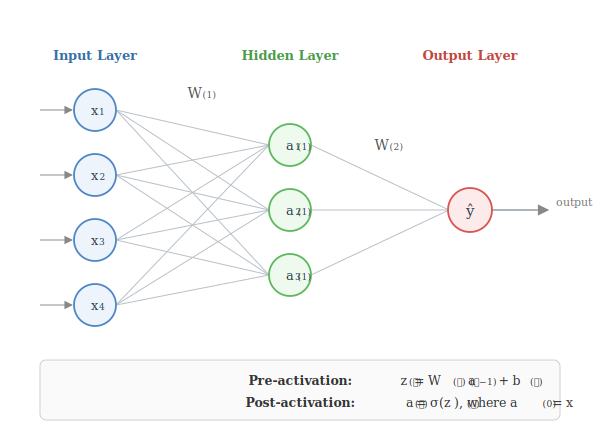
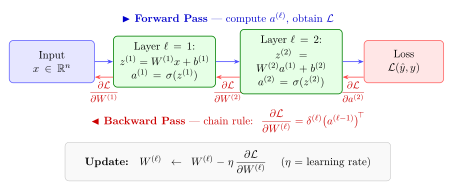

# 1. Basic Neural Network Design

---

## What Is a Neural Network?

A neural network is a parametric function $f_\theta : \mathbb{R}^n \to \mathbb{R}^k$ that maps an input $x$ to an output $\hat{y}$ through a sequence of **layers**. Each layer applies a linear transformation followed by a non-linear **activation function**.

Stacking layers allows the network to represent increasingly complex, non-linear functions — something a single linear model cannot do.



---

## Notation

| Symbol | Shape | Meaning |
|--------|-------|---------|
| $x$ | $\mathbb{R}^n$ | Input vector ($a^{(0)} = x$) |
| $W^{(\ell)}$ | $\mathbb{R}^{m \times n}$ | Weight matrix at layer $\ell$ — each row is a neuron's weights |
| $b^{(\ell)}$ | $\mathbb{R}^m$ | Bias vector at layer $\ell$ |
| $z^{(\ell)}$ | $\mathbb{R}^m$ | **Pre-activation**: the raw linear output before applying $\sigma$ |
| $a^{(\ell)}$ | $\mathbb{R}^m$ | **Post-activation**: output of neurons at layer $\ell$ after $\sigma$ |
| $\hat{y}$ | $\mathbb{R}^k$ | Final network output (prediction) |

### What $z$ and $a$ mean concretely

At every layer $\ell$:

$$z^{(\ell)} = W^{(\ell)}\, a^{(\ell-1)} + b^{(\ell)} \quad \text{(linear transform of previous layer's output)}$$

$$a^{(\ell)} = \sigma\!\bigl(z^{(\ell)}\bigr) \quad \text{(non-linear squashing of } z\text{)}$$

$z$ is called the **pre-activation** because it is the input *to* the activation function. $a$ is the **activation** — the value that flows forward to the next layer.

---

## Activation Functions

Without activation functions, stacking linear layers is mathematically equivalent to a single linear transform. Activations introduce **non-linearity**, giving the network expressive power.

| Function | Formula | Range | Derivative | Notes |
|----------|---------|-------|-----------|-------|
| **Sigmoid** $\sigma$ | $\dfrac{1}{1+e^{-z}}$ | $(0,1)$ | $\sigma(z)(1-\sigma(z))$ | Saturates; used in gates and binary output |
| **Tanh** | $\dfrac{e^z - e^{-z}}{e^z + e^{-z}}$ | $(-1,1)$ | $1 - \tanh^2(z)$ | Zero-centred; preferred over sigmoid in hidden layers |
| **ReLU** | $\max(0, z)$ | $[0,\infty)$ | $\mathbf{1}[z>0]$ | Fast; default for hidden layers in modern nets |
| **Softmax** | $\dfrac{e^{z_i}}{\sum_j e^{z_j}}$ | $(0,1)$, sums to 1 | — | Output layer for multi-class classification |

---

## Forward Propagation

Forward propagation computes the network output from input $x = a^{(0)}$ layer by layer:

$$z^{(\ell)} = W^{(\ell)}\, a^{(\ell-1)} + b^{(\ell)}, \qquad a^{(\ell)} = \sigma\!\bigl(z^{(\ell)}\bigr), \qquad \ell = 1, 2, \ldots, L$$

The final layer output $a^{(L)} = \hat{y}$.

**Why no activation on the final layer?** For regression we use the raw linear output; for classification we apply softmax. The activation choice depends on the task.

---

## Loss Functions

The loss $\mathcal{L}(\hat{y}, y)$ measures how far the prediction $\hat{y}$ is from the ground truth $y$. Training minimises this.

### Regression

$$\mathcal{L}_{\text{MSE}} = \frac{1}{n}\sum_{i=1}^{n}(\hat{y}_i - y_i)^2$$

MSE penalises large errors quadratically — sensitive to outliers.

### Binary Classification

$$\mathcal{L}_{\text{BCE}} = -\bigl[y\log\hat{y} + (1-y)\log(1-\hat{y})\bigr]$$

Minimising BCE is equivalent to maximising the log-likelihood under a Bernoulli model.

### Multi-class Classification

$$\mathcal{L}_{\text{CE}} = -\sum_{c=1}^{k} y_c \log\hat{y}_c$$

where $y$ is a one-hot vector. With softmax output, this simplifies to $-\log\hat{y}_{y_{\text{true}}}$.

---

## Backward Propagation (Backprop)

Backpropagation computes the gradient of the loss $\mathcal{L}$ with respect to every parameter using the **chain rule**.



### Chain Rule in One Layer

$$\frac{\partial \mathcal{L}}{\partial W^{(\ell)}} = \frac{\partial \mathcal{L}}{\partial a^{(\ell)}} \cdot \frac{\partial a^{(\ell)}}{\partial z^{(\ell)}} \cdot \frac{\partial z^{(\ell)}}{\partial W^{(\ell)}}$$

Breaking this down:
- $\dfrac{\partial a^{(\ell)}}{\partial z^{(\ell)}} = \sigma'\bigl(z^{(\ell)}\bigr)$ — derivative of the activation function
- $\dfrac{\partial z^{(\ell)}}{\partial W^{(\ell)}} = a^{(\ell-1)^\top}$ — the previous layer's activations
- $\dfrac{\partial \mathcal{L}}{\partial a^{(\ell)}}$ — the error signal flowing back from the next layer

### Parameter Update (Stochastic Gradient Descent)

$$W^{(\ell)} \leftarrow W^{(\ell)} - \eta \cdot \frac{\partial \mathcal{L}}{\partial W^{(\ell)}}$$

$$b^{(\ell)} \leftarrow b^{(\ell)} - \eta \cdot \frac{\partial \mathcal{L}}{\partial b^{(\ell)}}$$

where $\eta > 0$ is the learning rate.

### Full Training Loop

```
1. Initialise W^(ℓ), b^(ℓ) randomly (small values)
2. For each mini-batch:
   a. Forward pass  → compute activations a^(1), …, a^(L), loss ℒ
   b. Backward pass → compute ∂ℒ/∂W^(ℓ) for all ℓ  (chain rule)
   c. Update        → W^(ℓ) ← W^(ℓ) − η ∂ℒ/∂W^(ℓ)
3. Repeat until convergence
```

**Why mini-batches?** Full-batch gradient is expensive on large datasets. Mini-batches (e.g. 32–256 samples) give a noisy but cheap estimate of the true gradient — the noise can even help escape local minima.
