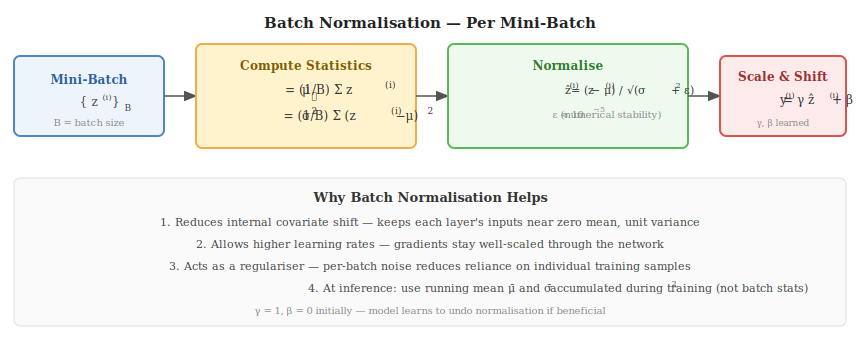

# 2. Training Issues & Solutions

---

## Vanishing & Exploding Gradients

### The Problem

During backprop, gradients are multiplied together as they flow back through layers:

$$\frac{\partial \mathcal{L}}{\partial W^{(1)}} = \frac{\partial \mathcal{L}}{\partial a^{(L)}} \cdot \prod_{\ell=2}^{L} \frac{\partial a^{(\ell)}}{\partial z^{(\ell)}} \cdot \frac{\partial z^{(\ell)}}{\partial a^{(\ell-1)}}$$

Each term $\dfrac{\partial a^{(\ell)}}{\partial z^{(\ell)}} = \sigma'(z^{(\ell)})$ is the derivative of the activation.

**Vanishing gradient** — if $\sigma'(z) \ll 1$ (e.g. sigmoid: $\sigma' \leq 0.25$), the product shrinks exponentially with depth:

$$\text{gradient at layer 1} \approx (0.25)^L \to 0 \quad \text{as } L \to \infty$$

Early layers receive near-zero gradients and learn nothing.

**Exploding gradient** — if weights are large, the product grows exponentially:

$$\text{gradient} \to \infty \quad \Rightarrow \quad \text{unstable training, NaN loss}$$

### Solutions

| Issue | Solution | How It Helps |
|-------|---------|--------------|
| Vanishing | **ReLU activations** | $\sigma'(z) = 1$ when $z>0$ — no shrinking |
| Vanishing | **Residual connections** (ResNet) | Gradients bypass layers through skip connections |
| Vanishing | **LSTM / GRU** | Gated cell state preserves gradients over long sequences |
| Exploding | **Gradient clipping** | $g \leftarrow g \cdot \dfrac{\tau}{\|g\|}$ if $\|g\| > \tau$ |
| Both | **Batch normalisation** | Re-centres activations, keeps gradients well-scaled |
| Both | **Careful initialisation** | Prevents initial activations from saturating |

---

## Weight Initialisation

Starting with the wrong weights causes saturation (all activations near 0 or 1) before training even begins.

### Xavier / Glorot Initialisation (for tanh / sigmoid)

$$W^{(\ell)} \sim \mathcal{U}\!\left(-\sqrt{\frac{6}{n_{\text{in}} + n_{\text{out}}}},\; \sqrt{\frac{6}{n_{\text{in}} + n_{\text{out}}}}\right)$$

Variance preserves signal magnitude through both forward and backward passes. Derived by requiring $\text{Var}(a^{(\ell)}) = \text{Var}(a^{(\ell-1)})$.

### He / Kaiming Initialisation (for ReLU)

$$W^{(\ell)} \sim \mathcal{N}\!\left(0,\; \frac{2}{n_{\text{in}}}\right)$$

The factor of 2 accounts for ReLU zeroing out half the neurons. Use this as the default when layers use ReLU.

| Activation | Recommended Init | Variance |
|-----------|-----------------|---------|
| sigmoid / tanh | Xavier | $\frac{2}{n_{\text{in}}+n_{\text{out}}}$ |
| ReLU | He | $\frac{2}{n_{\text{in}}}$ |
| Leaky ReLU | He (adjusted) | $\frac{2}{(1+\alpha^2)\,n_{\text{in}}}$ |

---

## Batch Normalisation

Batch normalisation (BN) normalises the pre-activations $z^{(\ell)}$ over a mini-batch before the activation function.

### The Four Steps (per mini-batch $\mathcal{B} = \{z^{(i)}\}_{i=1}^{B}$)

$$\mu_\mathcal{B} = \frac{1}{B}\sum_{i=1}^{B} z^{(i)} \qquad \text{(batch mean)}$$

$$\sigma^2_\mathcal{B} = \frac{1}{B}\sum_{i=1}^{B}\bigl(z^{(i)} - \mu_\mathcal{B}\bigr)^2 \qquad \text{(batch variance)}$$

$$\hat{z}^{(i)} = \frac{z^{(i)} - \mu_\mathcal{B}}{\sqrt{\sigma^2_\mathcal{B} + \varepsilon}} \qquad \text{(normalise; } \varepsilon \approx 10^{-5}\text{)}$$

$$y^{(i)} = \gamma\, \hat{z}^{(i)} + \beta \qquad \text{(scale and shift — } \gamma, \beta \text{ are learned)}$$

### Why It Helps

1. **Reduces internal covariate shift** — each layer sees inputs with stable statistics, making optimisation easier
2. **Allows higher learning rates** — well-scaled gradients at every layer
3. **Acts as a regulariser** — the per-batch noise reduces over-fitting (often less need for dropout)

### At Inference

Use the running mean $\bar{\mu}$ and variance $\bar{\sigma}^2$ accumulated during training — not per-batch statistics.

---

## Regularisation

Regularisation prevents **over-fitting** — the model memorising training data but failing on unseen data.

### L2 Regularisation (Weight Decay)

Add a penalty proportional to the squared magnitude of weights to the loss:

$$\mathcal{L}_{\text{reg}} = \mathcal{L} + \frac{\lambda}{2}\sum_{\ell}\|W^{(\ell)}\|_F^2$$

Effect: shrinks weights toward zero during every update. Large weights indicate the model has over-fitted.

$$W^{(\ell)} \leftarrow W^{(\ell)}\,(1 - \eta\lambda) - \eta\,\nabla_{W^{(\ell)}}\mathcal{L}$$

### L1 Regularisation (Lasso)

$$\mathcal{L}_{\text{reg}} = \mathcal{L} + \lambda \sum_{\ell}\|W^{(\ell)}\|_1$$

Encourages **sparsity** — many weights become exactly zero. Useful for feature selection.

### Dropout

During training, each neuron is independently zeroed with probability $p$ and the remaining neurons are scaled by $\frac{1}{1-p}$:

$$\tilde{a}^{(\ell)} = \frac{m \odot a^{(\ell)}}{1-p}, \quad m_i \sim \text{Bernoulli}(1-p)$$

At inference: all neurons active; no scaling needed (expected value equals training).

**Why it works:** forces the network to learn redundant representations — no single neuron can be relied upon. Equivalent to averaging over an ensemble of $2^n$ sub-networks.

| Regulariser | Penalty | Effect |
|------------|---------|--------|
| L2 | $\lambda \|W\|^2$ | Shrinks weights; smooth solution |
| L1 | $\lambda \|W\|_1$ | Sparse weights; implicit feature selection |
| Dropout | Stochastic zeroing $p$ | Redundant representations; ensemble effect |
| Early stopping | — | Stop training when validation loss stops improving |
| Data augmentation | — | Expands training set with transformed samples |

---

## Optimisers

### SGD with Momentum

Plain SGD can oscillate in ravines (high curvature in one direction, low in another). **Momentum** accumulates velocity in consistent gradient directions:

$$v_t = \beta v_{t-1} + (1-\beta)\,\nabla_W \mathcal{L}_t$$

$$W \leftarrow W - \eta\, v_t$$

Typical $\beta = 0.9$. The velocity $v_t$ is an exponential moving average of past gradients.

### Adam (Adaptive Moment Estimation)

Adam is the default optimiser for most deep learning tasks. It maintains per-parameter adaptive learning rates by tracking both the first and second moments of gradients.

**First moment** (mean of gradients):
$$m_t = \beta_1 m_{t-1} + (1-\beta_1)\,\nabla_W \mathcal{L}_t$$

**Second moment** (uncentred variance of gradients):
$$v_t = \beta_2 v_{t-1} + (1-\beta_2)\,(\nabla_W \mathcal{L}_t)^2$$

**Bias correction** (compensates for initialisation at zero):
$$\hat{m}_t = \frac{m_t}{1-\beta_1^t}, \qquad \hat{v}_t = \frac{v_t}{1-\beta_2^t}$$

**Parameter update:**
$$W \leftarrow W - \eta\,\frac{\hat{m}_t}{\sqrt{\hat{v}_t} + \varepsilon}$$

Default hyperparameters: $\beta_1 = 0.9$, $\beta_2 = 0.999$, $\varepsilon = 10^{-8}$.

**Why Adam works well:**
- Large gradient → large $\hat{v}_t$ → small effective step (self-regulating)
- Small gradient → small $\hat{v}_t$ → larger effective step (catches up on slow dimensions)
- Acts as a per-parameter adaptive learning rate

| Optimiser | Adaptive LR | Momentum | When to Use |
|-----------|------------|---------|-------------|
| SGD | No | No | Simple; requires careful LR tuning |
| SGD + Momentum | No | Yes | Better convergence; still needs LR tuning |
| RMSProp | Yes | No | Good for RNNs |
| **Adam** | **Yes** | **Yes** | **Default choice for most tasks** |
| AdamW | Yes | Yes | Adam + decoupled weight decay — preferred for Transformers |
