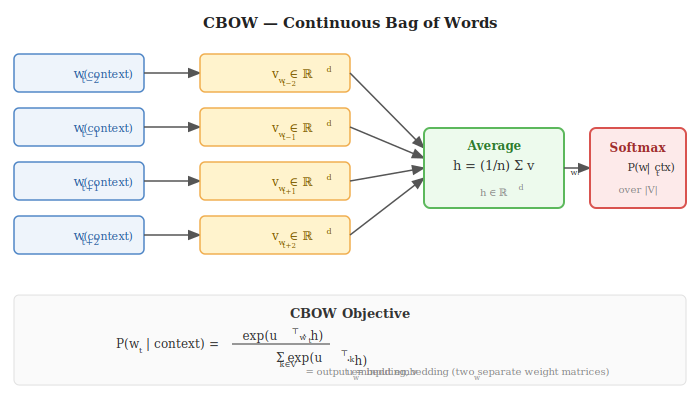

# 3. Word Embeddings

---

## The Problem: How Do We Represent Words?

Neural networks operate on real-valued vectors. Words are discrete symbols — we need a way to convert them into vectors that capture **semantic meaning**.

### Naive Approach: One-Hot Encoding

Assign each word in vocabulary $V$ a unique integer index. Represent word $w_i$ as:

$$\mathbf{e}_{w_i} \in \{0,1\}^{|V|}, \quad (\mathbf{e}_{w_i})_j = \mathbf{1}[j = i]$$

**Problems with one-hot:**
1. **Dimension** $|V|$ is huge ($\sim$ 50,000–500,000) — impractical
2. Every pair of words has the same dot product $= 0$ — no notion of similarity
3. "cat" and "dog" are as different as "cat" and "democracy" — no semantic structure

### Better Approach: Dense Embeddings

Map each word to a dense vector in $\mathbb{R}^d$ (typically $d = 50$–$300$) such that **semantically similar words have similar vectors**:

$$\cos\!\left(v_{\text{king}} - v_{\text{man}} + v_{\text{woman}},\; v_{\text{queen}}\right) \approx 1$$

These vectors are **learned from data** — not hand-crafted. The key insight:

> **Distributional hypothesis** — words that appear in similar contexts have similar meanings
> (*Firth, 1957: "A word is characterised by the company it keeps"*)

---

## How Are Embeddings Learned?

We train a shallow neural network on a **self-supervised prediction task** using raw text. The task is artificial; what we actually want are the **weight matrices as embeddings**.

Two tasks (Word2Vec, Mikolov et al. 2013):

| Model | Task | Given | Predict |
|-------|------|-------|---------|
| **CBOW** | Fill in center word | Context window $\{w_{t-k}, \ldots, w_{t+k}\} \setminus w_t$ | Center word $w_t$ |
| **Skip-Gram** | Fill in context | Center word $w_t$ | Each context word $w_{t+j}$ |

---

## CBOW — Continuous Bag of Words

### Step 1 — Lookup embeddings for context words

Each word $w_i$ has an **input embedding** $v_{w_i} \in \mathbb{R}^d$ (row of the embedding matrix $V_{\text{in}} \in \mathbb{R}^{|V| \times d}$).

### Step 2 — Average the context embeddings

$$h = \frac{1}{n}\sum_{i=1}^{n} v_{w_i} \quad \in \mathbb{R}^d$$

### Step 3 — Predict the center word via softmax

Each word also has an **output embedding** $u_{w} \in \mathbb{R}^d$ (row of a separate matrix $V_{\text{out}}$):

$$P(w_t \mid \text{context}) = \frac{\exp\!\left(u_{w_t}^\top h\right)}{\displaystyle\sum_{k \in V} \exp\!\left(u_k^\top h\right)}$$

### Objective

Maximise the log-probability of the correct center word:

$$\mathcal{L} = -\log P(w_t \mid \text{context})$$

---

## Skip-Gram

Instead of predicting center from context, Skip-Gram predicts each context word given the center:

$$\mathcal{L} = -\sum_{-k \leq j \leq k,\, j \neq 0} \log P(w_{t+j} \mid w_t)$$

$$P(w_{t+j} \mid w_t) = \frac{\exp\!\left(u_{w_{t+j}}^\top v_{w_t}\right)}{\displaystyle\sum_{k \in V} \exp\!\left(u_k^\top v_{w_t}\right)}$$

Skip-Gram tends to work better for rare words; CBOW is faster.

---

## Negative Sampling

Full softmax over $|V| \approx 10^5$ words is too expensive. **Negative sampling** replaces it with a binary classification task:

> "Is word $w$ a real context word of $w_t$, or a random noise word?"

$$\mathcal{L}_{\text{NEG}} = \log\sigma\!\left(u_w^\top v_{w_t}\right) + \sum_{i=1}^{K} \mathbb{E}_{w_i \sim P_n}\!\left[\log\sigma\!\left(-u_{w_i}^\top v_{w_t}\right)\right]$$

where $K \approx 5$–$20$ negatives per positive, and $P_n(w) \propto f(w)^{3/4}$ (word frequency raised to $\frac{3}{4}$ power — smooths the distribution to reduce dominance of very common words).

**Practical rules:**
- Never sample the positive context word as a negative
- Sample with replacement

---

## FastText

FastText (Bojanowski et al. 2017) extends Word2Vec by representing each word as a **sum of its character n-gram embeddings**:

$$v_w = \sum_{g \in \mathcal{G}(w)} z_g$$

where $\mathcal{G}(w)$ is the set of character n-grams of $w$ (e.g. for $n=3$: `<wh`, `whe`, `her`, `ere`, `re>`).

**Advantages:**
- Handles out-of-vocabulary words (unseen words still have character n-grams)
- Better morphology — "running" shares n-grams with "runs", "runner"

---

## Contextual Embeddings (ELMo, BERT)

Static embeddings (Word2Vec, GloVe) assign each word a single fixed vector regardless of context. "Bank" has one vector whether it means a financial institution or a river bank.

**ELMo** (Embeddings from Language Models) produces **context-dependent** representations using a bidirectional LSTM trained as a language model. The embedding of word $w_t$ depends on the full sentence.

**BERT** uses a Transformer encoder with masked language modelling — see Section 6.

| Method | Context-aware | Architecture | Pretrained on |
|--------|--------------|-------------|---------------|
| Word2Vec | No | Shallow NN | Text corpus |
| GloVe | No | Matrix factorisation | Co-occurrence matrix |
| FastText | No | Word2Vec + n-grams | Text corpus |
| ELMo | Yes | BiLSTM LM | Large corpus |
| BERT | Yes | Transformer encoder | Wikipedia + Books |
