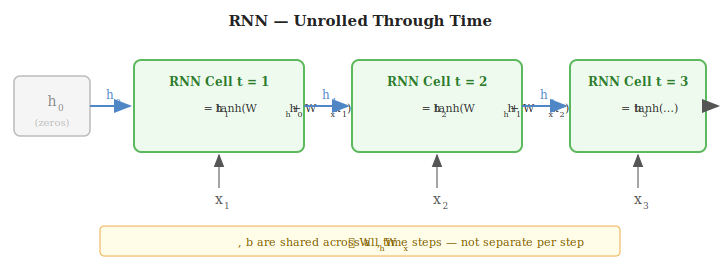
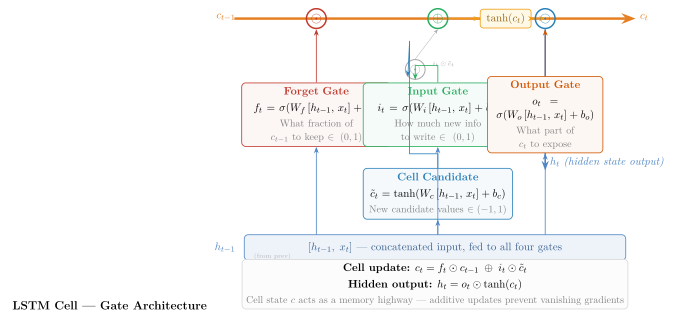

# 4. RNNs & LSTMs

---

## Why Recurrent Networks?

Feedforward networks treat all inputs as independent. Many real-world tasks involve **sequences** where order matters and earlier elements affect later predictions:
- Language: "The bank by the *river*" vs "Deposit at the *bank*"
- Time series: tomorrow's stock price depends on today's
- Speech: phoneme recognition depends on surrounding phonemes

A **Recurrent Neural Network** (RNN) processes one element at a time while maintaining a **hidden state** $h_t$ that summarises everything seen so far.

---

## RNN Architecture

### Recurrence Equation

At each time step $t$:

$$h_t = \tanh\!\bigl(W_h\, h_{t-1} + W_x\, x_t + b_h\bigr)$$

| Symbol | Shape | Meaning |
|--------|-------|---------|
| $x_t$ | $\mathbb{R}^n$ | Input at time step $t$ |
| $h_t$ | $\mathbb{R}^m$ | Hidden state at time $t$ — the network's "memory" |
| $h_0$ | $\mathbb{R}^m$ | Initial hidden state (all zeros) |
| $W_h$ | $\mathbb{R}^{m \times m}$ | Recurrent weight matrix |
| $W_x$ | $\mathbb{R}^{m \times n}$ | Input weight matrix |
| $b_h$ | $\mathbb{R}^m$ | Bias |

> $W_h$, $W_x$, $b_h$ are the **same** at every time step — not separate per step.

### Language Modelling Output

Project $h_t$ to vocabulary size $|V|$ and apply softmax:

$$\text{logits}_t = W_{\text{vocab}}\, h_t + b_{\text{vocab}}, \quad W_{\text{vocab}} \in \mathbb{R}^{|V| \times m}$$

$$P(w_t = k \mid w_{<t}) = \frac{\exp(\text{logits}_t[k])}{\displaystyle\sum_j \exp(\text{logits}_t[j])}$$

### Limitation: Vanishing Gradients in RNNs

The gradient of the loss at step $T$ w.r.t. $h_1$ requires multiplying $W_h^\top$ by itself $T-1$ times — this vanishes (or explodes) exponentially. In practice, plain RNNs cannot learn dependencies beyond ~10–20 steps.

---

## LSTM — Long Short-Term Memory

LSTMs (Hochreiter & Schmidhuber 1997) solve the vanishing gradient problem by introducing a **cell state** $c_t$ — a "conveyor belt" of memory that can carry information across hundreds of time steps.

### The Key Idea

The cell state update is **additive**, not multiplicative:

$$c_t = \underbrace{f_t \odot c_{t-1}}_{\text{retain old memory}} \oplus \underbrace{i_t \odot \tilde{c}_t}_{\text{add new memory}}$$

Gradients can flow back through the $\oplus$ operation without shrinking — this is the **constant error carousel**.

### Gate Equations

All four gates receive the concatenated input $[h_{t-1};\, x_t]$:

| Gate | Equation | Role |
|------|---------|------|
| **Forget** $f_t$ | $\sigma(W_f [h_{t-1}, x_t] + b_f)$ | What fraction of $c_{t-1}$ to erase — output $\in (0,1)$ |
| **Input** $i_t$ | $\sigma(W_i [h_{t-1}, x_t] + b_i)$ | How much new info to write — output $\in (0,1)$ |
| **Cell candidate** $\tilde{c}_t$ | $\tanh(W_c [h_{t-1}, x_t] + b_c)$ | New candidate values to potentially store — output $\in (-1,1)$ |
| **Output** $o_t$ | $\sigma(W_o [h_{t-1}, x_t] + b_o)$ | What part of $c_t$ to expose as $h_t$ — output $\in (0,1)$ |

**Cell state update:**
$$c_t = f_t \odot c_{t-1} \oplus i_t \odot \tilde{c}_t$$

**Hidden state output:**
$$h_t = o_t \odot \tanh(c_t)$$

$\sigma$ outputs in $(0,1)$ act as soft gates: 0 = block everything, 1 = pass everything through.

### Dimensions

| Parameter | Shape | Interpretation |
|-----------|-------|----------------|
| $W_f, W_i, W_c, W_o$ | $\mathbb{R}^{m \times (m+n)}$ | Each gate has its own weight matrix over $[h_{t-1}, x_t]$ |
| $b_f, b_i, b_c, b_o$ | $\mathbb{R}^m$ | One bias per gate |
| $c_t, h_t$ | $\mathbb{R}^m$ | Hidden and cell state dimension |

---

## Bidirectional RNNs / LSTMs

A standard RNN reads the sequence left-to-right. For tasks like NER or text classification, it helps to have both past and future context at every position.

A **Bidirectional LSTM** runs two LSTMs:

$$\overrightarrow{h}_t = \text{LSTM}_{\rightarrow}(x_t, \overrightarrow{h}_{t-1}) \quad \text{(reads left-to-right)}$$

$$\overleftarrow{h}_t = \text{LSTM}_{\leftarrow}(x_t, \overleftarrow{h}_{t+1}) \quad \text{(reads right-to-left)}$$

Concatenate to get the full contextual representation:

$$h_t = \bigl[\overrightarrow{h}_t;\, \overleftarrow{h}_t\bigr] \in \mathbb{R}^{2m}$$

---

## ELMo — Embeddings from Language Models

ELMo (Peters et al. 2018) trains a deep bidirectional LSTM as a **language model** on a large corpus, then uses the internal representations as contextual word embeddings.

### Training Objective

$$\mathcal{L}_{\text{fwd}} = -\sum_{t} \log P(w_t \mid w_1, \ldots, w_{t-1};\; \overrightarrow{\theta})$$

$$\mathcal{L}_{\text{bwd}} = -\sum_{t} \log P(w_t \mid w_{t+1}, \ldots, w_N;\; \overleftarrow{\theta})$$

$$\mathcal{L} = \mathcal{L}_{\text{fwd}} + \mathcal{L}_{\text{bwd}}$$

### Computing Token Probabilities

From hidden state $h_t$:

$$\text{logits}_t = W_{\text{vocab}}\, h_t + b_{\text{vocab}}, \quad W_{\text{vocab}} \in \mathbb{R}^{|V| \times m}$$

$$P(w_t = k \mid \text{context}) = \frac{\exp(\text{logits}_t[k])}{\displaystyle\sum_j \exp(\text{logits}_t[j])}, \qquad \mathcal{L}_t = -\log P(w_t^{\text{true}} \mid \text{context})$$

### ELMo Representation

Each token gets a weighted combination of all BiLSTM layer representations:

$$\text{ELMo}_t = \gamma \sum_{k=0}^{K} s_k\, h_t^{(k)}$$

where $s_k$ (softmax-normalised) and $\gamma$ are task-specific scalars learned during fine-tuning.

---

## Loss Functions for Sequence Tasks

| Task | Loss | Notes |
|------|------|-------|
| Language modelling | Cross-entropy $-\log P(w_t \mid \text{context})$ | Summed over all tokens |
| Time series regression | MSE: $\frac{1}{T}\sum_t (\hat{y}_t - y_t)^2$ | Default for continuous outputs |
| Time series (robust) | Huber loss | Quadratic near 0, linear far — handles outliers |
| Sequence labelling (NER) | Cross-entropy per token | Optional: add CRF layer for label dependencies |
