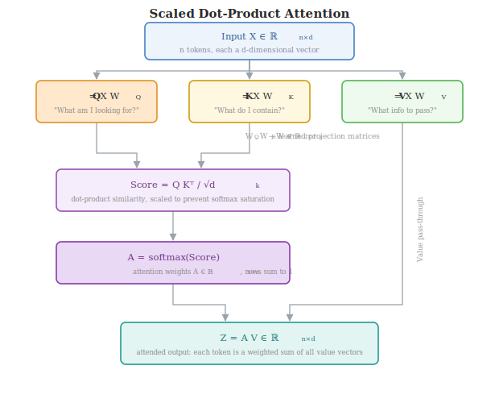
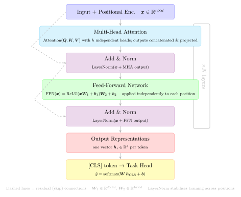

# Transformers & Attention

---

## Motivation

RNNs process sequences step-by-step — to propagate information from position 1 to position 100, it must pass through 99 hidden states. This is a bottleneck: long-range dependencies are hard to learn, and the architecture cannot be parallelised.

**Self-attention** solves both problems: every token can **directly attend** to every other token in $O(1)$ operations, regardless of distance.

---

## Input Representation

Each token in the input sequence is converted to a vector by combining:

$$\text{input}_t = \text{TokenEmbedding}(w_t) + \text{PE}(t)$$

The positional encoding $\text{PE}(t)$ injects position information because self-attention is **permutation-invariant** — without it, "I love cats" and "cats love I" are identical.

### Positional Encoding (Vaswani et al. 2017)

$$\text{PE}(t, 2i) = \sin\!\left(\frac{t}{10000^{2i/d_{\text{model}}}}\right)$$

$$\text{PE}(t, 2i+1) = \cos\!\left(\frac{t}{10000^{2i/d_{\text{model}}}}\right)$$

Different dimensions encode position at different frequencies — low dimensions change rapidly (word level), high dimensions change slowly (sentence level). The pattern is deterministic and fixed (not learned).

---

## Scaled Dot-Product Attention

### Projecting to Q, K, V

For an input matrix $X \in \mathbb{R}^{n \times d}$ ($n$ tokens, $d$ dimensions):

$$Q = X W^Q, \quad K = X W^K, \quad V = X W^V$$

where $W^Q, W^K, W^V \in \mathbb{R}^{d \times d_k}$ are learned projection matrices.

- **Query** $Q$: "What am I looking for?"
- **Key** $K$: "What do I contain / match?"
- **Value** $V$: "What information do I actually send?"

### Attention Computation

$$\text{Attention}(Q, K, V) = \text{softmax}\!\left(\frac{QK^\top}{\sqrt{d_k}}\right) V$$

Step by step:

1. **Score** $= QK^\top \in \mathbb{R}^{n \times n}$ — raw similarity between every query-key pair
2. **Scale** by $\dfrac{1}{\sqrt{d_k}}$ — prevents softmax saturation when $d_k$ is large (dot products grow with dimension)
3. **Softmax** row-wise → attention weights $A \in \mathbb{R}^{n \times n}$, each row sums to 1
4. **Weighted sum** of values: output $Z = AV \in \mathbb{R}^{n \times d_k}$

---

## Multi-Head Attention

Running a single attention head forces the model to mix all types of relationships (syntax, semantics, coreference) in one representation. Multi-head attention runs $h$ attention heads **in parallel** with different projections:

$$\text{head}_i = \text{Attention}(Q W_i^Q,\; K W_i^K,\; V W_i^V)$$

$$\text{MultiHead}(Q, K, V) = \text{Concat}(\text{head}_1, \ldots, \text{head}_h)\, W^O$$

where $W_i^Q, W_i^K, W_i^V \in \mathbb{R}^{d \times d_k}$, $d_k = d_{\text{model}} / h$, $W^O \in \mathbb{R}^{d \times d}$.

Different heads learn to attend to different relationship types (e.g. head 1: syntactic dependencies, head 2: coreference).

---

## Transformer Encoder Block

One encoder block:

### Feed-Forward Network

Applied independently to each position (same weights across positions):

$$\text{FFN}(x) = \text{ReLU}(x W_1 + b_1)\, W_2 + b_2$$

$W_1 \in \mathbb{R}^{d \times d_{ff}}$, $W_2 \in \mathbb{R}^{d_{ff} \times d}$; typically $d_{ff} = 4d$.

### Residual Connection + Layer Normalisation

Applied after both sub-layers (MHA and FFN):

$$\text{output} = \text{LayerNorm}(x + \text{sublayer}(x))$$

The **residual connection** ensures gradients can flow back without vanishing, and allows the model to choose how much to transform vs pass through.

### Stacking $N$ Blocks

- **BERT-base:** $N = 12$, $d_{\text{model}} = 768$, $h = 12$
- **GPT-2 large:** $N = 36$, $d_{\text{model}} = 1280$

---

## Encoder vs Decoder Architectures

| Architecture | Attention Type | Examples | Best For |
|--------------|---------------|---------|---------|
| **Encoder only** (BERT) | Bidirectional self-attention | BERT, RoBERTa | Understanding: classification, NER, QA |
| **Decoder only** (GPT) | Causal (masked) self-attention | GPT-2/3/4, LLaMA | Generation: language modelling, chat |
| **Encoder–Decoder** (T5) | Bidirectional enc + cross-attention dec | T5, BART, mT5 | Seq2seq: translation, summarisation |

**Causal (masked) attention** — the decoder cannot attend to future tokens. Achieved by setting scores to $-\infty$ for $j > i$ before softmax.

---

## Classification with Transformers (BERT-style)

1. Prepend a special `[CLS]` token to the input
2. Run through $N$ encoder blocks
3. Take the `[CLS]` vector $h_{\text{CLS}} \in \mathbb{R}^{d}$ — it aggregates information from the whole sequence
4. Pass through a task-specific classification head:

$$\hat{y} = \text{softmax}(W\, h_{\text{CLS}} + b), \quad W \in \mathbb{R}^{k \times d}$$

Fine-tune all parameters (including encoder weights) on labelled data.

---

## BERT Pre-training

BERT is pre-trained on two self-supervised tasks:

### Masked Language Modelling (MLM)

Randomly mask 15% of tokens; predict them from context:

$$\mathcal{L}_{\text{MLM}} = -\sum_{t \in \text{masked}} \log P(w_t \mid \text{context})$$

Forces the model to use **bidirectional** context — unlike GPT which only sees left context.

### Next Sentence Prediction (NSP)

Given two sentences A and B, predict whether B follows A in the original text. (Later work showed NSP contributes little; RoBERTa removed it.)
