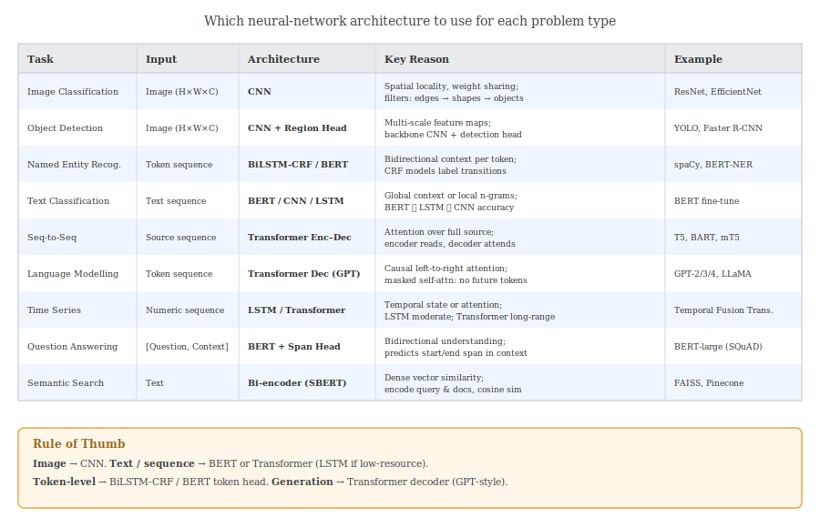

# 7. Architecture Guide — Which Network for Which Problem?

---

## Overview



---

## Image Tasks

### Image Classification
**Architecture:** CNN (ResNet, EfficientNet, VGG)

**Why CNN:**
- Images have local spatial structure — edges and shapes are defined by nearby pixels
- The same pattern (e.g. a circle) can appear anywhere — CNNs learn it once via weight sharing

**Standard approach:**
1. Use a pretrained backbone (e.g. ResNet-50 trained on ImageNet)
2. Replace the final FC layer with a new head matching your number of classes
3. Fine-tune the whole network on your data

```
Input (H×W×3) → [Conv+BN+ReLU] × N → MaxPool × K → Flatten → FC → Softmax
```

**When to use Transformer instead:** Very large datasets ($>1M$ images) — Vision Transformer (ViT) can match or beat CNNs but needs more data.

---

### Object Detection
**Architecture:** CNN backbone + detection head (YOLO, Faster R-CNN, SSD)

**Why:** Need to localise **and** classify objects simultaneously. CNN backbone extracts multi-scale feature maps; detection head predicts bounding boxes and class labels at each scale.

---

## Text / NLP Tasks

### Text Classification (Sentiment, Spam, Topic)
**Architecture:** BERT fine-tune (default) | CNN (fast baseline) | BiLSTM (sequence-aware baseline)

**Why BERT first:**
- Pre-trained on billions of words — general language understanding out of the box
- Fine-tuning on even small datasets ($\sim$1k examples) usually outperforms training from scratch

**When to use CNN/LSTM:** Low latency inference (embedded systems), very small training data where full fine-tuning over-fits, multilingual settings without a multilingual BERT.

**Setup:**
```
Input tokens → BERT → [CLS] vector → Linear(d, k) → Softmax
```

---

### Named Entity Recognition (NER)
**Architecture:** BERT + token-level classifier | BiLSTM-CRF

**Why token-level:** NER assigns a label to **each token** — not just the whole sequence.

**BERT approach:**
```
Input tokens → BERT → h₁, h₂, …, hₙ  (one vector per token)
Each hᵢ → Linear(d, num_labels) → Softmax  →  label per token
```

**BiLSTM-CRF approach:**
- BiLSTM captures bidirectional context
- CRF (Conditional Random Field) layer models **label transition probabilities** (e.g. `I-ORG` cannot follow `B-PER`)

$$P(\mathbf{y} \mid \mathbf{x}) = \frac{\exp\!\bigl(\sum_t \psi(y_{t-1}, y_t, h_t)\bigr)}{\displaystyle\sum_{\mathbf{y}'} \exp\!\bigl(\sum_t \psi(y'_{t-1}, y'_t, h_t)\bigr)}$$

**Rule of thumb:** BERT > BiLSTM-CRF for accuracy; BiLSTM-CRF for low-resource or fast inference.

---

### Sequence-to-Sequence (Translation, Summarisation)
**Architecture:** Transformer Encoder–Decoder (T5, BART, mT5)

**Why Encoder–Decoder:**
- Encoder reads the full source sequence (bidirectional)
- Decoder generates output token-by-token using **cross-attention** over encoder output

**Cross-attention:** the decoder's query $Q$ comes from the partially generated output; keys and values $K, V$ come from the encoder. This lets the decoder "look up" relevant parts of the source.

```
Source → Encoder → context vectors K, V
Target (shifted right) → Decoder (causal attn) → cross-attn(K, V) → output
```

---

### Language Modelling / Text Generation
**Architecture:** Transformer Decoder only (GPT-2, GPT-3/4, LLaMA)

**Why Decoder only:** Language modelling is autoregressive — predict the next token given all previous tokens. Causal (masked) attention ensures position $t$ cannot see position $t+1, \ldots, T$.

$$P(w_1, w_2, \ldots, w_T) = \prod_{t=1}^{T} P(w_t \mid w_1, \ldots, w_{t-1})$$

---

### Question Answering (Extractive)
**Architecture:** BERT + span extraction head

**Setup:** input = `[CLS] Question [SEP] Context [SEP]`

BERT outputs contextual representations $h_1, \ldots, h_n$. Two linear classifiers predict:
- Start position: $P_{\text{start}}(i) = \text{softmax}(W_s\, h_i)$
- End position: $P_{\text{end}}(j) = \text{softmax}(W_e\, h_j)$

Answer = the span from $i$ to $j$ with highest combined probability.

---

## Time Series Tasks

### Forecasting
**Architecture:** LSTM (moderate sequences) | Temporal Fusion Transformer (long sequences + exogenous features)

**Why LSTM:** Naturally models temporal dependencies; output at each step is a function of all previous inputs through hidden state.

**Why Transformer:** For very long sequences or when the relevant context is non-local (e.g. same day of week patterns many weeks apart).

Loss: MSE for point forecasts; quantile regression loss for probabilistic forecasts.

---

## Multimodal Tasks

| Task | Architecture |
|------|-------------|
| Image captioning | CNN (vision) + Transformer decoder (text) |
| Visual QA | CLIP encoder (image + text) + fusion |
| Document understanding | LayoutLM (text + spatial layout) |

---

## Decision Tree

```
Is input an image?
  ├── Yes  → CNN  (+ Transformer if large dataset)
  └── No   → Is output a sequence?
               ├── Yes (generation)  → Transformer decoder (GPT-style)
               ├── Yes (translation/summarisation) → Transformer enc-dec
               └── No (classification/labelling)
                    ├── Token-level labels (NER, POS) → BERT + token head (or BiLSTM-CRF)
                    ├── Sequence-level label (sentiment, topic) → BERT + [CLS] head
                    └── Numeric output (regression, forecasting) → LSTM or Transformer
```

---

## Summary Table

| Task | Input Type | Recommended Architecture | Pre-trained Model |
|------|-----------|--------------------------|------------------|
| Image classification | Image | CNN (ResNet, EfficientNet) | ImageNet weights |
| Object detection | Image | CNN + detection head | COCO weights |
| Text classification | Text | BERT encoder | BERT, RoBERTa |
| NER / POS tagging | Tokens | BERT + token head or BiLSTM-CRF | BERT |
| Translation | Seq → Seq | Transformer enc-dec | mT5, BART |
| Summarisation | Long text → Short text | Transformer enc-dec | BART, PEGASUS |
| Language modelling | Tokens | Transformer decoder | GPT, LLaMA |
| Extractive QA | (Q, context) | BERT + span head | BERT-large |
| Time series regression | Numeric seq | LSTM / Transformer | — (train from scratch) |
| Semantic search | Text | Bi-encoder (SBERT) | Sentence-BERT |
